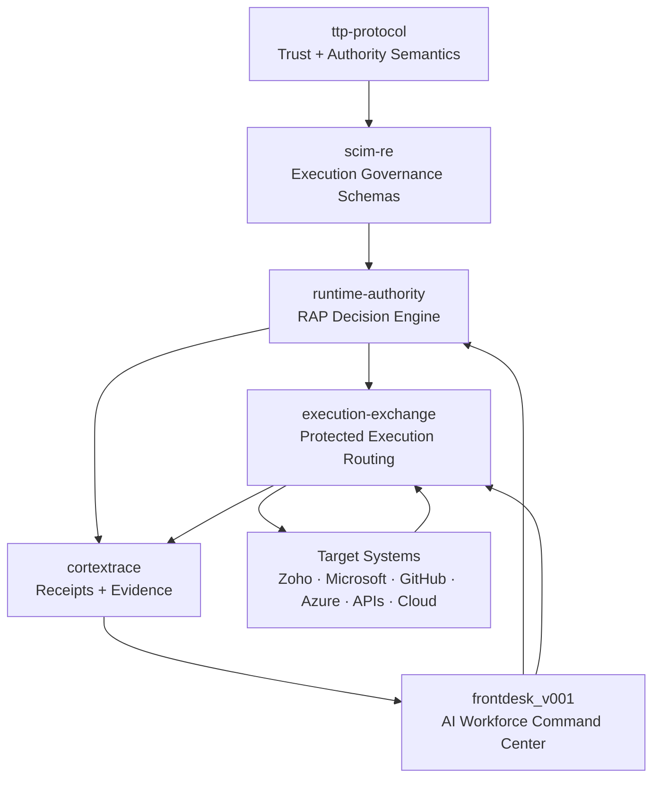

<div align="center">
  

  <h1>Trust Transfer Protocol (TTP)</h1>

  <p><strong>Trust semantics for autonomous execution.</strong></p>

  <p>Runtime authority infrastructure for continuous AI execution.</p>

  <p>
    
    
    
  </p>
</div>

> [!WARNING]
> Identity is not authority. A valid token is not sufficient to permit protected execution.

[](SPECIFICATION.md)
[](MVP.md)
[](package.json)
[](THREAT_MODEL.md)
[](SECURITY.md)
[](LICENSE)

TTP is a platform-agnostic trust protocol and cryptographic trust layer for agentic systems. It generates verifiable proofs that a trust threshold is met before execution is allowed — and those proofs are checkable by any verifier, at any time, without calling back to the issuer.

BlockSiFr provides runtime authority infrastructure for continuous AI execution. As AI systems move from single prompts to persistent multimodal work sessions, BlockSiFr verifies authority before meaningful actions execute and generates receipts proving what happened, why it was allowed, and under what trust state.

## BlockSiFr Stack Alignment

TTP expresses trust. SCIM-RE structures execution. RAP decides authority. Execution Exchange routes protected execution. CortexTrace records proof. FrontDesk operationalizes it.



<table>
  <tr>
    <td><strong>Continuous Trust</strong><br/>Trust changes as sessions, signals, attestations, and risk change.</td>
    <td><strong>Authority Semantics</strong><br/>Grants, constraints, provenance, decay, and proof are expressed consistently.</td>
    <td><strong>Receipt Proof</strong><br/>Downstream layers can prove why protected execution was allowed, constrained, or denied.</td>
  </tr>
</table>

It is designed for AI agents, non-human identities, automation pipelines, service accounts, APIs, and cross-system workflows where static access is not enough.

TTP answers one question:

> Can this actor prove enough current trust to attempt this action now?

TTP does not replace IAM, SCIM, OPA, PAM, SPIFFE, OAuth, OIDC, API gateways, or policy engines. It provides the trust expression layer that runtime authority systems can evaluate before execution.

> **Status:** Protocol specification draft complete. Reference implementation in active development.  
> **Current milestone:** MVP parser + trust decay evaluator.  
> **Production use:** Not yet recommended.

---

## Why TTP Exists

Modern systems increasingly delegate meaningful work to agents, pipelines, service accounts, and autonomous workflows. These actors may hold valid credentials while their trust context is stale, overbroad, delegated too far, or no longer appropriate for the action they are about to attempt.

Identity systems prove who an actor is. Policy engines decide whether a rule allows an action. TTP fills the gap between those layers by expressing current, scoped, decaying trust that can be evaluated before execution.

TTP is useful when reviewers need to know:

| Question | TTP Contribution |
| --- | --- |
| Is this trust claim fresh enough? | Expiration and freshness requirements |
| Has trust decayed below the action threshold? | Time-aware trust decay evaluation |
| Who issued this trust, and for what scope? | Issuer, domain, scope, and evidence fields |
| Is delegated authority still bounded? | Delegation and authority context grammar |
| What result should a runtime authority system evaluate? | Structured trust context and evaluation output |

---

## What TTP Is

TTP is:

- A portable trust expression protocol.
- A declarative language for trust claims, proof requirements, authority context, delegation, expiration, and decay.
- A grammar runtime authority systems can evaluate before autonomous execution.
- A foundation for interoperability between agent runtimes, NHI governance systems, policy engines, gateways, and audit surfaces.
- A protocol layer beneath BlockSiFr runtime authority products and reference implementations.

---

## What TTP Is Not

TTP is not:

- A replacement for IAM, OAuth, OIDC, SAML, SCIM, SPIFFE, PAM, OPA, Cedar, API gateways, SIEM, or SOAR.
- A complete governance product or control plane.
- A runtime enforcement gateway by itself.
- A blockchain-dependent system.
- Production-ready cryptographic infrastructure in the current MVP.
- A claim that trust can be made permanent, universal, or risk-free.

Runtime enforcement belongs in systems such as RAP, Execution Exchange, and integrated gateways. TTP supplies the trust grammar those systems can evaluate.

---

## Core Concepts

| Concept | Meaning |
| --- | --- |
| Subject | Actor whose trust is being evaluated, such as an agent, service account, workload, API, or pipeline. |
| Trust claim | A scoped statement that a subject has a trust score issued by a trust issuer. |
| Trust issuer | Entity that issues or attests to a trust claim. Issuers must be validated by the evaluator or runtime authority layer. |
| Trust score | Numeric signal, usually `0.0` to `1.0`, representing current trust for a specific scope. |
| Trust decay | Time-based reduction of effective trust after issuance. |
| Delegation | Bounded transfer of authority from one subject or issuer context to another. |
| Authority context | Action, resource, proof, and runtime context required before execution. |
| Proof | Requirement that a subject must satisfy, including threshold, freshness, issuer, and proof mode. |
| Attestation | Evidence from an issuer, runtime, gateway, or governance system supporting a trust claim. |
| Threshold | Required trust score for a proof or authority context. |
| Expiration | Time after which a trust claim or proof must fail. |
| Evaluation result | Structured output showing effective score, required score, result, reason, proof mode, and evaluation time. |

---

## Simple Example

```ttp
subject "agent:invoice_reviewer" {
  type = "ai_agent"
  issuer = "blocksifr.local"
  domain = "finance"
}

trust "agent:invoice_reviewer" {
  issuer = "verifiedtrust:tenant_123"
  score = 0.86
  issued_at = "2026-05-11T12:00:00Z"
  expires_at = "2026-05-11T18:00:00Z"

  decay {
    model = "linear"
    half_life = "6h"
    minimum = 0.40
  }

  scope = [
    "invoice.read",
    "invoice.recommend"
  ]
}

proof "invoice_review_threshold" {
  subject = "agent:invoice_reviewer"
  required_score = 0.75
  mode = "cleartext-dev"
  freshness = "30m"
}

authority_context "invoice_review" {
  action = "invoice.recommend"
  resource = "invoice:*"
  requires = proof.invoice_review_threshold
}
```

More examples are in [`examples/`](examples/).

---

## CLI Preview

The current CLI is an MVP reference scaffold. It performs basic parsing, validation, linear trust decay, expiration checks, threshold checks, and JSON output.

```bash
npm run ttp -- check examples/01-basic-agent.ttp
npm run ttp -- eval examples/02-trust-decay.ttp --subject agent:invoice_reviewer --at now
npm run ttp -- version
```

Expected JSON shape:

```json
{
  "subject": "agent:invoice_reviewer",
  "effective_score": 0.84,
  "required_score": 0.75,
  "result": "TRUST_PROOF_VALID",
  "reason": "effective trust score meets threshold",
  "proof_mode": "cleartext-dev",
  "evaluated_at": "2026-05-11T12:30:00.000Z"
}
```

## Examples Gallery

| Example | What it shows | File |
| --- | --- | --- |
| Trust threshold proof | Deterministic trust proof output | `examples/trust-threshold-proof.json` |
| Attestation verification | Freshness and issuer validation | `examples/attestation-verification.json` |
| Trust decay application | Time-based trust degradation | `examples/trust-decay-application.json` |
| Delegation validity | End-to-end delegated authority check | `examples/delegation-valid.json` |
| Trust route validity | Cross-system trust path validation | `examples/trust-route-valid.json` |
| Receipt proof | Proof consumed by RAP / SCIM-RE | `specs/execution-receipt.md` |

See `spec/`, `profiles/`, and `examples/` for normative docs, profile mappings, and test vectors.
