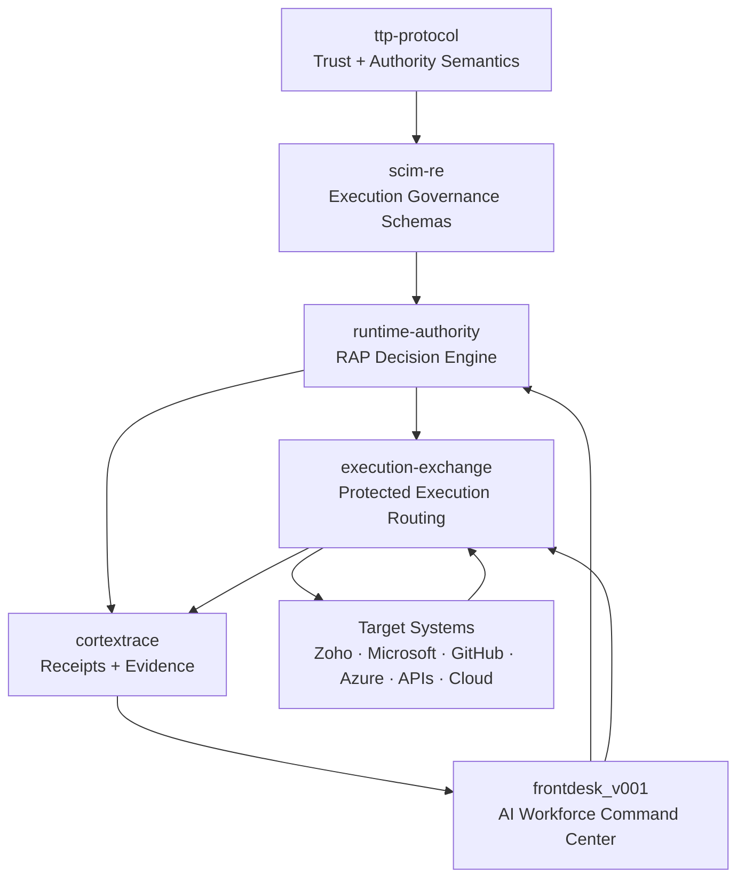

<div align="center">
  

  <h1>Trust Transfer Protocol (TTP)</h1>

  <p><strong>Trust semantics for autonomous execution.</strong></p>

  <p>Runtime authority infrastructure for continuous AI execution.</p>

  <p>
    
    
    
  </p>
</div>

> [!WARNING]
> Identity is not authority. A valid token is not sufficient to permit protected execution.

**Without TTP, any system can claim trust. With TTP, trust must be provable.**

TTP is a platform-agnostic trust protocol and cryptographic trust layer for agentic systems. It generates verifiable proofs that a trust threshold is met before execution is allowed — and those proofs are checkable by any verifier, at any time, without calling back to the issuer.

BlockSiFr provides runtime authority infrastructure for continuous AI execution. As AI systems move from single prompts to persistent multimodal work sessions, BlockSiFr verifies authority before meaningful actions execute and generates receipts proving what happened, why it was allowed, and under what trust state.

## BlockSiFr Stack Alignment

TTP expresses trust. SCIM-RE structures execution. RAP decides authority. Execution Exchange routes protected execution. CortexTrace records proof. FrontDesk operationalizes it.



<table>
  <tr>
    <td><strong>Continuous Trust</strong><br/>Trust changes as sessions, signals, attestations, and risk change.</td>
    <td><strong>Authority Semantics</strong><br/>Grants, constraints, provenance, decay, and proof are expressed consistently.</td>
    <td><strong>Receipt Proof</strong><br/>Downstream layers can prove why protected execution was allowed, constrained, or denied.</td>
  </tr>
</table>

## What breaks without TTP

- Authority decisions rely on trust that is asserted but never verified
- Decayed or revoked attestations remain valid indefinitely with no signal
- No proof artifact exists — auditors see a decision with no supporting evidence
- Delegated trust chains cannot be validated end-to-end

## 30-second demo

```bash
npm install
node --test tests/*.test.mjs
```

```js
import {
  prove_trust_threshold,
  verify_attestation,
  apply_decay,
  generate_trust_proof
} from './src/index.mjs';

// 1. Compute a verifiable trust threshold proof
const thresholdProof = prove_trust_threshold({
  subject:           'agent_007',
  trustScore:        0.876,
  requiredThreshold: 0.7,
  dimension:         'execution',
  evaluatedAt:       new Date().toISOString(),
});
console.log(thresholdProof.satisfied);  // true
console.log(thresholdProof.proofHash);  // deterministic proof hash

// 2. Verify an attestation object
const attestationResult = verify_attestation({
  attestation: {
    subject:         'agent_007',
    issuer:          'authority.example.com',
    type:            'signed_activity',
    expiresAt:       new Date(Date.now() + 3_600_000).toISOString(),
    issuedAt:        new Date().toISOString(),
    trustScoreDelta: 0.1,
    ref:             'att_ref_001',
    claims:          { scope: 'execute' },
  },
  subject: 'agent_007',
  validAt: new Date().toISOString(),
});
console.log(attestationResult.valid);   // true

// 3. Apply time-based trust decay
const decayed = apply_decay({
  initialTrust:   0.876,
  decayConstant:  0.0001,
  elapsedSeconds: 3600,
});
console.log(decayed.finalTrust);  // ~0.841 — degraded but still above threshold

// 4. Compose a full verifiable trust proof (consumed by RAP / SCIM-RE)
const proof = generate_trust_proof({
  subject:             'agent_007',
  action:              'deploy',
  resource:            'cluster/prod',
  trustThresholdProof: thresholdProof,
  attestationResults:  [attestationResult],
  delegationResults:   [],
  routeResult:         { valid: true, routeId: 'route_001' },
  generatedAt:         new Date().toISOString(),
});
console.log(proof.valid);       // true
console.log(proof.proofHash);   // verifiable by any downstream consumer
```

## Layer boundary

- A2A moves agent messages.
- MCP exposes tools.
- SCIM-RE normalizes runtime authority objects.
- TRP resolves trust paths.
- RAP decides execution authority.
- TTP proves whether trust is valid enough to support that decision.

TTP answers: trust validity, decay status, threshold satisfaction proof, delegation validity, transfer validity, route validity, and verifier-checkable proof outputs.

TTP does not implement platform adapters or platform field mappings.

## Core primitive functions

- `prove_trust_threshold()`
- `verify_attestation()`
- `apply_decay()`
- `verify_delegation()`
- `verify_trust_route()`
- `generate_trust_proof()`
- `validate_transfer()`

## Minimal flow

```text
request context
     ↓
trust route resolved by TRP
     ↓
trust proof generated by TTP
     ↓
authority evaluated by RAP / SCIM-RE
     ↓
execution allowed only if authority is valid
```

## Non-goals

- TTP does not replace SCIM-RE.
- TTP does not implement platform adapters.
- TTP does not replace A2A or MCP.
- TTP does not decide enterprise business policy by itself.
- TTP supplies trust proofs and validation primitives to the authority layer.

## Quickstart

```bash
npm install
node --test tests/*.test.mjs
```

```js
import {
  prove_trust_threshold,
  verify_attestation,
  apply_decay,
  verify_delegation,
  verify_trust_route,
  validate_transfer
} from './src/index.mjs';
```

## Examples Gallery

| Example | What it shows | File |
| --- | --- | --- |
| Trust threshold proof | Deterministic trust proof output | `examples/trust-threshold-proof.json` |
| Attestation verification | Freshness and issuer validation | `examples/attestation-verification.json` |
| Trust decay application | Time-based trust degradation | `examples/trust-decay-application.json` |
| Delegation validity | End-to-end delegated authority check | `examples/delegation-valid.json` |
| Trust route validity | Cross-system trust path validation | `examples/trust-route-valid.json` |
| Receipt proof | Proof consumed by RAP / SCIM-RE | `specs/execution-receipt.md` |

See `spec/`, `profiles/`, and `examples/` for normative docs, profile mappings, and test vectors.
