<p align="center">
  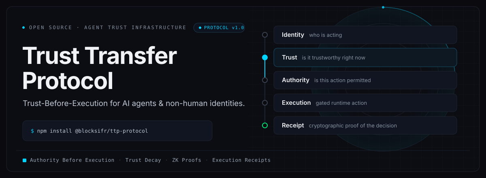
</p>

<p align="center">
  <a href="https://github.com/BlockSiFr/ttp-protocol/actions/workflows/ci.yml"></a>
  
  <a href="LICENSE"></a>
  <a href="https://www.npmjs.com/package/@blocksifr/pctr"></a>
  
</p>

<p align="center">
  <strong>See what your agents can cause. Route them safely. Prove what happened.</strong><br>
  Open-source trust and execution infrastructure for AI agents.
</p>

<p align="center">
  <a href="#60-seconds"><b>Try it in 60 seconds</b></a> &nbsp;·&nbsp;
  <a href="packages/pctr/"><b>PCTR</b></a> &nbsp;·&nbsp;
  <a href="examples/"><b>Examples</b></a> &nbsp;·&nbsp;
  <a href="SPECIFICATION.md"><b>Protocol spec</b></a> &nbsp;·&nbsp;
  <a href="CONTRIBUTING.md"><b>Contribute</b></a>
</p>

---

Your agent can have valid credentials and still be about to do the wrong thing.

```
Objective  ->  Trust Route  ->  Consequence Preview  ->  Execution Authority  ->  Protected Action  ->  Receipt
```

## 60 seconds

**[PCTR](packages/pctr/)** — Protected Consequence Trust Routing — maps every agent, tool and action in your project to the consequences it can reach, then protects the ones that matter. It answers three questions, in this order:

| | Question | Command |
| --- | --- | --- |
| **1. Consequence** | What can this action cause? | `pctr preview <action>` |
| **2. Route** | Which trustworthy agent path may get there? | `pctr route <action>` |
| **3. Authority** | Is this exact execution allowed right now? | `pctr protect <action>` |

```bash
npx @blocksifr/pctr init   # discover agents and tools, write pctr.json
npx @blocksifr/pctr scan   # what consequences can they reach?
```

No agents in the project? `init` says so rather than inventing any; `--example` writes a
worked example that every view labels as made-up.

<p align="center">
  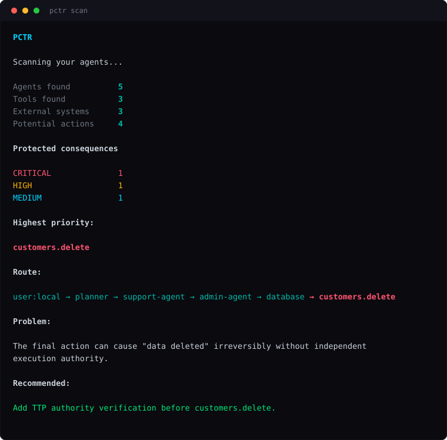
</p>

`pctr scan --share` turns that into Markdown you can paste into a pull request, and
`packages/pctr/examples/pctr-scan.yml` runs it on every PR as a comment.

No account, no network: everything stays in `./pctr.json` and `./.pctr`. Three flagship capabilities sit on top of that graph — the **Consequence Twin** (`pctr preview`), **TrustRoute Autopilot** (`pctr route`), and the **Agent Time Machine** (`pctr replay`, `pctr explain`) — with Ed25519-signed receipts, read-only probes that measure a consequence instead of declaring it, adapters for the common agent frameworks, and an effect boundary (`pctr serve`) that verifies authority in its own process. See the [PCTR README](packages/pctr/README.md), `npm run demo:pctr` and `npm run demo:pctr-fabric`.

PCTR routes to the consequence. TTP binds the authority for the exact execution that reaches it.

## Under the hood: the Trust Transfer Protocol

Identity proves *who* is acting. Authorization defines *what* was assigned. **TTP establishes whether the actor is trustworthy enough for this action, right now** — before any downstream authority or execution decision is made.

OAuth standardized delegated access. SCIM standardized identity provisioning. **TTP standardizes trust-before-execution for autonomous systems.** It is a platform-agnostic trust protocol — bring any agent, IdP, gateway, or workflow.

<p align="center">
  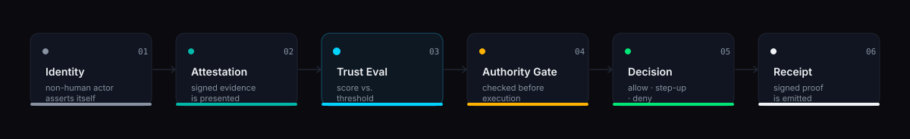
</p>

## Why TTP Exists

Software is moving from advising to acting. Agents call tools, copilots trigger workflows, pipelines modify production, service accounts move data. The old model — `authenticate → authorize → execute → log` — never asks the question that matters at runtime:

> **Should this specific action execute right now, given how trustworthy the actor is at this moment?**

<p align="center">
  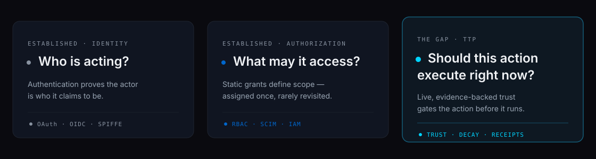
</p>

## How TTP Works

Trust is established from evidence, scored against a threshold, and checked at a runtime authority gate **before** the action runs. The gate consumes a trust proof, an authority grant, and the current decay state — then emits a decision and a signed receipt.

<p align="center">
  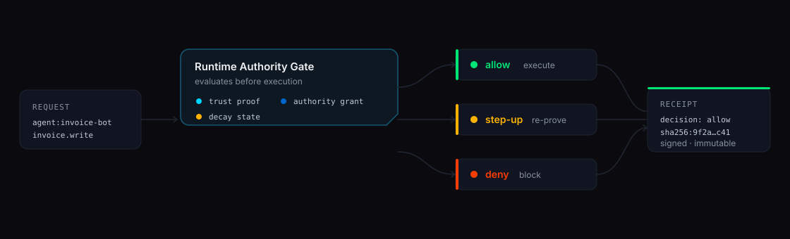
</p>

### Runtime Decisions

A trust proof resolves into one of five outcomes. TTP establishes the trust context; downstream runtime authority systems enforce the decision.

<p align="center">
  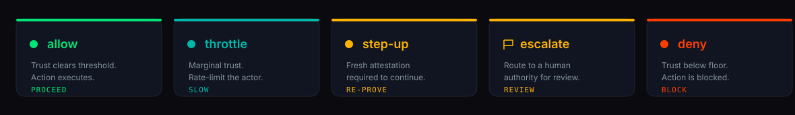
</p>

## First Example

Declare a subject, attach evidence, and require a trust threshold before the action is allowed:

```ttp
trust "invoice_agent" {
  subject     = agent:invoice-bot
  issuer      = trust-issuer:finance-control
  score       = 0.91
  decay       = exponential(halflife = 6h)   # trust weakens without fresh evidence
  scope       = [invoice.read, invoice.write]
  evidence    = [attestation:att-7b3c, receipt:rcpt-01J9F4]
}

policy "write_invoices" {
  action            = invoice.write
  require_trust     = 0.80                     # threshold the proof must clear
  on_below          = step-up                  # otherwise demand fresh attestation
  execution_policy  = gate                     # decide before execution, fail closed
  emit              = execution_receipt        # cryptographic proof of the decision
}
```

Trust does not stay still. Without fresh attestation it **decays** through `active → degraded → warning → critical`; a new attestation **recharges** it.

<p align="center">
  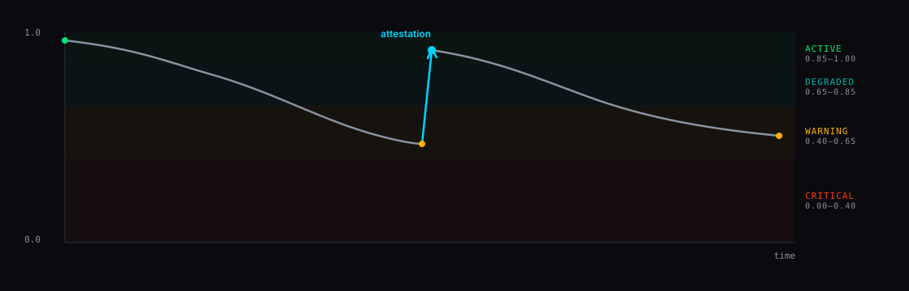
</p>

## Execution Receipts

Every decision produces a signed, hash-chained `ExecutionReceipt` — evidence, not a log line. It records what was decided, the trust state behind it, and the cryptographic basis to verify it later.

<p align="center">
  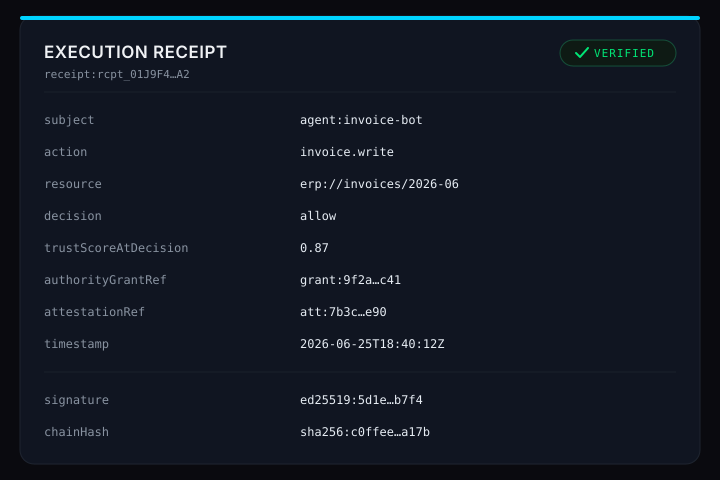
</p>

## Architecture

TTP is the foundation layer. Runtime governance, the authority gate, and the enterprise control plane build on it; agent frameworks, CI/CD, APIs, and copilots consume it.

<p align="center">
  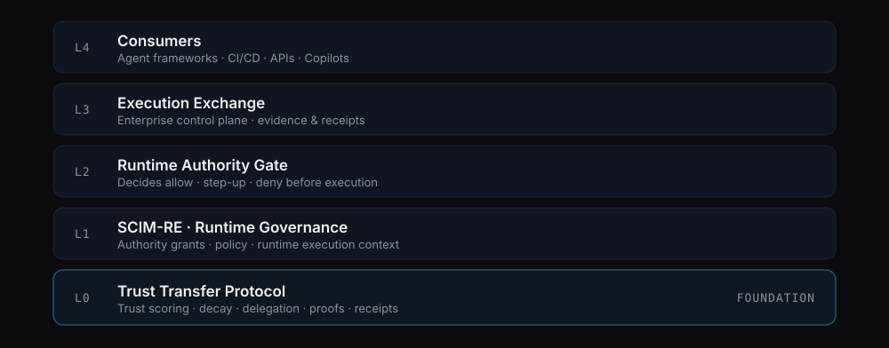
</p>

> TTP establishes trustworthiness. **SCIM-RE** structures runtime context, **RAP** evaluates authority, **Execution Exchange** enforces decisions, and **CortexTrace** records evidence. TTP does not enforce execution by itself — see [docs/COMMERCIAL_BOUNDARY.md](docs/COMMERCIAL_BOUNDARY.md).

## Integrations

Bring your existing agents — no rewrite, no IdP replacement. TTP wraps the boundary where an action happens.

<p align="center">
  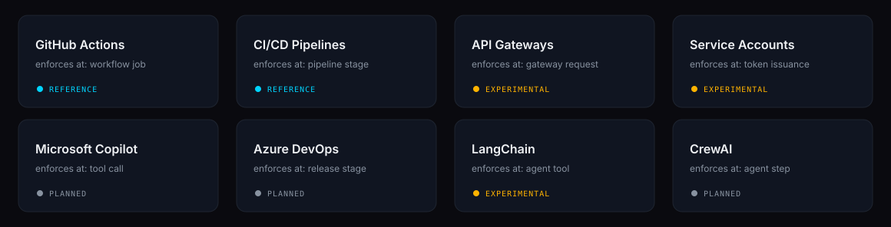
</p>

## Roadmap

<p align="center">
  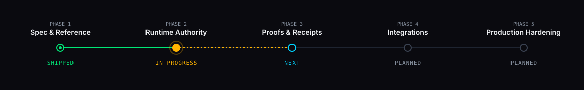
</p>

## Quickstart

```bash
git clone https://github.com/BlockSiFr/ttp-protocol.git
cd ttp-protocol
npm install
npm test

# evaluate the reference examples
npm run ttp -- check examples/01-basic-agent.ttp
npm run ttp -- eval  examples/02-trust-decay.ttp --subject agent:invoice_reviewer --at now
npm run demo
```

`check` validates a `.ttp` file; `eval` evaluates a subject's trust at a point in time; `demo` prints reference decisions, trust scores, and `ExecutionReceipt` identifiers for local, non-production scenarios.

## Protocol Primitives

| Primitive | Meaning |
| --- | --- |
| **Subject** | The agent, service account, pipeline, API client, workload, or workflow being evaluated. |
| **TrustClaim** | A scoped statement that a Subject holds a trust score or state, issued by a trust issuer. |
| **AuthorityGrant** | A bounded right relied on only when trust, freshness, scope, and constraints are satisfied. |
| **Attestation** | Fresh evidence that the subject, credential, workload, or runtime context remains valid. |
| **TrustDecay** | The time-based weakening of trust when fresh evidence is absent. |
| **Delegation** | Bounded transfer of trust or authority from one subject to another. |
| **IsnadChain** | A verifiable chain of trust transmission from a rooted authority to the acting subject. |
| **TrustProof** | A structured proof that trust conditions were evaluated and satisfied — or not. |
| **RuntimeDecision** | A downstream enforceable decision: `allow`, `throttle`, `step-up`, `escalate`, `deny`. |
| **ExecutionReceipt** | A signed proof object recording the decision, trust state, authority basis, and receipt chain. |

## Open Protocol, Commercial Enforcement

Open-source TTP includes the protocol grammar, trustworthiness semantics, the trust-proof model, public schemas, example `.ttp` files, SDK primitives, a reference evaluator, and the TrustDecay model. Production enforcement — managed Runtime Authority Gate, the Execution Exchange control plane, HSM-backed signing, and the CortexTrace evidence engine — is commercial BlockSiFr infrastructure. The boundary is explicit in [docs/COMMERCIAL_BOUNDARY.md](docs/COMMERCIAL_BOUNDARY.md).

## Security

TTP is a protocol draft and reference implementation. **Do not use `cleartext-dev` proof mode in production.** Production trust establishment and enforcement require a trusted issuer registry, signed claims, replay protection, clock integrity, key rotation, tenant isolation, fail-closed enforcement, receipt signing, and audit retention. See [SECURITY.md](SECURITY.md) and [THREAT_MODEL.md](THREAT_MODEL.md).

## Contributing

From a first issue to owning a protocol surface — the path is open and intentional. Start with [CONTRIBUTING.md](CONTRIBUTING.md) and [docs/GOVERNANCE.md](docs/GOVERNANCE.md).

<p align="center">
  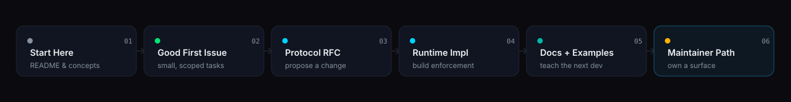
</p>

## License

[Apache-2.0](LICENSE) · A [BlockSiFr](https://blocksifr.com) open protocol · Trust-Before-Execution for autonomous systems.
