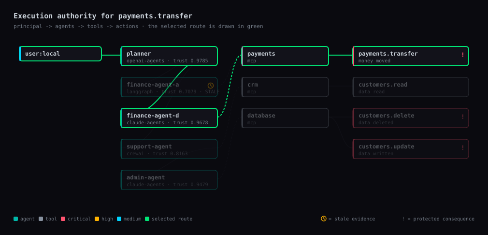

# PCTR — Protected Consequence Trust Routing

**See what your agents can cause. Route them safely. Prove what happened.**

Your agent can have valid credentials and still be about to do the wrong thing.

```
Objective  ->  Trust Route  ->  Consequence Preview  ->  Execution Authority  ->  Protected Action  ->  Receipt
```

## 60 seconds


```bash
npx @blocksifr/pctr init    # discover agents and tools, write pctr.json
npx @blocksifr/pctr scan    # what consequences can they reach?
```

If the project has no agents, `init` says so rather than inventing any. To see how a
scan reads, `npx @blocksifr/pctr init --example` writes a worked example — and every
view of it is labelled as made-up data, so it can never be mistaken for findings about
your code.

Or install it: `npm i -g @blocksifr/pctr`, then just `pctr init` and `pctr scan`.

No account. No network. Everything stays in `./pctr.json` and `./.pctr`.

## Share what you find

```bash
pctr scan --share           # writes pctr-report.md
```

Drops straight into a pull request or an issue: a severity table, the highest-priority
consequence with the route that reaches it, and what to do about it. Add
`packages/pctr/examples/pctr-scan.yml` to `.github/workflows/` and every PR gets the same
report as a comment, with `fail-on: critical` to block a merge when an agent can reach an
irreversible consequence.

```markdown
## 🛑 PCTR consequence scan

**5 agents · 3 tools · 4 actions.** 3 of them can cause a protected consequence, and 2 cannot be undone.

| Severity | Consequences |
| --- | --- |
| 🔴 CRITICAL | 1 |
| 🟠 HIGH | 1 |

### Highest priority: `customers.delete`

Causes **data deleted** · **irreversible** · 1,842 records · blast radius WIDE
```

## The three questions

| Question | Command | Answers |
| --- | --- | --- |
| **Consequence** — what can this action cause? | `pctr preview <action>` | records, money, reversibility, blast radius |
| **Route** — which trustworthy agent path may get there? | `pctr route <action>` | the selected path, and why every other one was rejected |
| **Authority** — is this exact execution allowed right now? | `pctr protect <action>` | an allow/deny decision plus a verifiable receipt |

## Consequence Twin

See what your AI is about to change before it changes it — `git diff` for autonomous
agents. It reasons over the graph and the parameters you declare; it does not query your
live systems (see [Honest limits](#honest-limits)).

```bash
pctr preview customers.delete --records 1842
```

```
CONSEQUENCE PREVIEW

Action                customers.delete
Causes                data deleted
Records affected      1842
Reversible            NO
Connected workflows   4
Blast radius          WIDE (100/100)
Routes that reach it  1
Risk                  CRITICAL

Recommended

- Require TTP execution authority bound to these exact parameters
- Limit batch to 25 records (currently 1842) + require approval
- Notify 4 connected workflows before executing
- Verify authority at the effect boundary, not in the calling agent
```

## TrustRoute Autopilot

The right trustworthy agent gets the job automatically. Admissibility is decided first;
only routes that survive are optimized for latency and cost. A security constraint is
never traded away for a faster or cheaper route.

```bash
pctr route payments.transfer --amount 18000
```

```
ROUTE SELECTED

user:local
  |
  v
planner
  |
  v
finance-agent-d
  |
  v
payments
  |
  v
payments.transfer

Effective trust       0.9178 (0.9 required for CRITICAL)
Hops                  5
Human approval        REQUIRED

Rejected routes

user:local -> planner -> finance-agent-a -> payments -> payments.transfer
  x finance-agent-a evidence is 4200s old; CRITICAL actions require evidence under 300s
  x effective trust 0.6579 is below the 0.9 required for CRITICAL consequences
```

At $1,800 the same action is `HIGH` and needs no approval; the amount is what moves it to
`CRITICAL`. Material parameters change the consequence, and the consequence sets the bar.

`finance-agent-a` was the *faster* route. It was still rejected.

## Agent Time Machine

Replay exactly why your AI did what it did.

```bash
pctr protect payments.transfer --amount 18000
pctr replay
pctr explain EXECUTION_DENIED
```

```
WHY WAS THIS EXECUTION DENIED?

policy requires human approval for CRITICAL consequences

Because

- Objective received: protect payments.transfer
- Action proposed: payments.transfer ($18000)
- Consequence detected: MONEY_MOVED (CRITICAL)
- Route selected: user:local -> planner -> finance-agent-d -> payments -> payments.transfer
```

Every answer is derived from the recorded causal chain, not re-narrated by a model.
Runs can also be forked and compared:

```bash
pctr replay <run> --fork e3
pctr replay <run> --compare <other-run>
```

## The loop closes: `pctr learn`

Every protected execution leaves evidence. Without a learning step that evidence just
piles up; with one, the map, the policy and the discovery gaps get better the longer the
system runs — which is the entire claim.

```bash
pctr learn            # what the accumulated receipts and runs say to change
pctr learn --apply    # write the proposed changes into pctr.json
```

```
WHAT THIS RUN TAUGHT PCTR

Receipts analysed     10
Runs analysed         10

HIGH   payments.transfer declares $1800 but has moved up to $18,000
       Approval thresholds key off this, so the declared value has been under-protecting this action.
       can be applied automatically

MEDIUM planner holds authority "*" but has only ever used 1
       Observed: payments.transfer. Narrowing authority to what it actually does shrinks the blast radius.

MEDIUM payments.transfer has been denied 5× for APPROVAL_REQUIRED
       Something keeps asking for what policy keeps refusing.
```

It finds undeclared actions that executed anyway, consequences declared smaller than they
turned out to be, agents whose evidence is chronically stale, wildcard authority nobody
uses, approvals that are always granted (a rubber stamp) or never granted (a wall),
protected actions with no admissible route, and denials that keep repeating.

**Findings are proposals, never silent edits.** `--apply` is a separate, explicit act, and
each finding carries the evidence it came from so you can disagree with it. After
applying, `pctr preview payments.transfer` with no arguments returns `CRITICAL` where it
used to say `HIGH` — because the system now knows what that action actually moves.

## Nine answers, not two: `pctr decide`

A trust change is not a binary. Denying everything that wobbles is as wrong as allowing
it — the useful answer is usually narrower than "no".

```bash
pctr decide customers.delete --records 1842
```

```
TRUST REEVALUATION

Action                customers.delete
Response              CONSTRAIN
Proceeds              YES

1,842 records is above the batch limit of 25; bound it and the consequence is recoverable

Proposed bound: {"recordsAffected":25}
```

| Response | When | Proceeds |
| --- | --- | --- |
| `KEEP` | nothing material changed | yes |
| `REROUTE` | the route changed, a trustworthy path remains | yes |
| `CONSTRAIN` | admissible once the parameters are bounded | yes |
| `THROTTLE` | permitted, but not at this rate | yes |
| `STEP_UP` | same principal, stronger evidence required | no |
| `ESCALATE` | above this principal's authority entirely | no |
| `SUSPEND` | the agent stops until something is repaired | no |
| `DENY` | this execution does not happen | no |
| `REVOKE` | the authority itself is withdrawn | no |

Checks run most-restrictive first, so a revoked credential is never answered with a
reroute. `reconcile()` refuses to answer a change with a weaker response than it
warranted — that is how authority expands by accident.

## The graph as a picture

```bash
pctr graph --svg                          # the whole map
pctr graph --svg route.svg payments.transfer   # with the selected route drawn
```



Columns run principal → agents → tools → actions. Agents carry their framework, current
trust and a clock mark when their evidence is stale; actions are coloured by severity and
marked `!` when they are a protected consequence; naming an action draws its selected
route in green and dims everything else. The SVG is standalone — no fonts, no scripts, no
network — so it drops straight into a README or a ticket.

Every graph carries an `aria-label` describing the route in words, because a picture that
only works for people who can see it is not documentation.

## Routing learns from what actually happened

`resolveRoute` accepts the history PCTR has accumulated, and prefers routes that work:

```js
import { summarizeHistory, resolveRoute } from '@blocksifr/pctr';
const history = summarizeHistory(receipts);
resolveRoute(graph, 'payments.transfer', { history });
```

A route with a record of failing loses to an equally trustworthy one that doesn't — but
**history only ever reorders routes that already passed every admissibility check.** A
flawless record buys an agent no authority it lacks; there's a test asserting exactly
that. Optimization happens after admissibility, never instead of it.

## Testing a policy against real history: `pctr whatif`

Once `learn` starts proposing policy changes, the next question is what that change would
have done to executions that already happened.

```bash
pctr whatif --policy '{"approvalThresholds":{"amount":25000}}'
```

```
WHAT IF THIS POLICY HAD BEEN IN FORCE

Executions replayed   10
Decided the same      5
Would tighten         3
Would loosen          1

1 execution(s) that were refused would now proceed

  customers.update {"recordsAffected":4000} → would now proceed
     CONSTRAIN: 4,000 records is above the batch limit of 25; bound it and the consequence is recoverable
```

Nothing executes; each recorded receipt is re-decided under the proposed policy. It exits
non-zero when a change would **loosen** anything, so it works as a CI gate on policy
edits. Note that raising an approval threshold cannot unlock a CRITICAL consequence — the
severity comes from what the action can cause, not from the rule that reads it.

## Measured trust, not declared trust: `pctr attest`

Everything downstream of a trust score is rigorous about it — thresholds, decay, route
admissibility, execution authority. None of that means much while the score itself is a
number somebody typed into `pctr.json`.

```bash
pctr attest            # measure every agent from evidence
pctr attest planner    # one agent, in detail
```

```
MEASURED TRUST: PLANNER

Measured trust        0.8251 (Good)
Declared in manifest  0.98
Drift                 -0.1549 — overstated
Evidence              8 receipt(s) from 1 issuer(s)
Oldest evidence       937s

Issuers

  pctr.effect-boundary         score 0.825115  weight 1 (capped)

Clears MEDIUM bar (0.6)  YES
Threshold proof       sha256:8568aa97ed1e48b2b8feafd…
```

**The rule that governs all of it: absent evidence is not trust.** An agent with no
attestations does not inherit its declared score — it comes back `UNPROVEN`, counts as
zero, and a protected consequence will not route through it (`TRUST_UNPROVEN`). The
failure mode this exists to prevent is a typed-in `0.99` silently authorising a payment.

Evidence comes from two places:

- **PCTR's own execution receipts**, scored on the scale in
  [`protocol/scoring-semantics.md`](../../protocol/scoring-semantics.md) §3.2: a clean
  execution is 0.95, reaching for authority it lacks is 0.15, replaying an authority is
  0.20, waiting on a human approval is 0.75 — that last one matters, because an agent
  blocked on a human is not an agent misbehaving.
- **Attestors you configure**, a module or command per agent, returning TTP attestations
  or behavioural receipts. Each attestation is verified with TTP's own
  `verify_attestation`, so a stale one, or one about a different subject, contributes
  nothing. A failing attestor yields *no* evidence — never favourable evidence.

```json
{ "attestors": { "planner": ["./attestors/workload-identity.mjs"], "*": [{ "command": "./attest.sh" }] } }
```

Aggregation is the normative algorithm in
[`protocol/aggregation-spec.md`](../../protocol/aggregation-spec.md) — time decay,
negative-signal amplification, per-issuer weight capping — and `pctr attest` emits a TTP
`TrustThresholdProof` naming the evidence it rests on.

### The aggregation algorithm was corrected to v1.1

Implementing `protocol/aggregation-spec.md` surfaced a real defect in it, now fixed.

v1.0's step 5 capped a dominant issuer at `max_issuer_weight` (0.40) and then
**re-normalized across all issuers** — which handed the capped issuer its excess straight
back whenever the others were light. With 50 receipts from one issuer and one each from
two others, the "capped" issuer still held **87%** of the weight and the score came out at
0.90. The cap only bit when the rest of the field was already comparable, which is exactly
the case where a cap isn't needed.

v1.1 redistributes a capped issuer's excess to the **uncapped** issuers instead, and
applies `effective_cap = max(max_issuer_weight, 1 / issuer_count)` because a cap below
`1/n` is infeasible. That same input now gives the dominant issuer exactly 0.40 and a
score of **0.52**.

Vector `agg-006` was written to assert precisely this intent — *"4 good receipts from A
cannot dominate 1 bad receipt from B"* — and did not pass under v1.0. It passes under
v1.1 unchanged. Two other vectors were repaired: `agg-003` contradicted itself and was
superseded by its own corrected variant, and `agg-008` was off by 0.0010 from rounded
intermediate weights. Three vectors were added covering redistribution, the `1/n` floor,
and the single-issuer case. All eleven pass.

**This changes conformance.** A v1.0 implementation produces different scores wherever one
issuer exceeds the cap while the others are light.

## Execution authority

A valid identity is not enough. A valid credential is not enough. A valid route is not
enough. Authority binds principal, delegator, session, action, target, material
parameters, constraints, policy, consequence, validity window and nonce — and the effect
boundary verifies it independently of the agent that asked.

```js
import { issueAuthority, verifyAuthority } from '@blocksifr/pctr';

const authority = issueAuthority({
  principal: 'user:ops', action: 'payments.transfer', target: 'acct:9931',
  params: { amount: 1800 }, consequence: 'MONEY_MOVED', route
});

// Same authority, changed amount — possession is not authority.
verifyAuthority(authority, { action: 'payments.transfer', target: 'acct:9931', params: { amount: 18000 } });
// -> { allowed: false, failures: [{ code: 'PARAMETER_MISMATCH', ... }] }
```

Authority also expires and can only be spent once (`REPLAYED_AUTHORITY`).

## Receipts

Every protected execution produces verifiable evidence of what was
requested, who delegated it, which route was selected, what consequence was identified,
what parameters were bound, which verifier checked it, and what actually executed.

```bash
pctr receipt         # show the last one
pctr verify          # verify all of them, including the chain
```

A receipt that records an execution which was never allowed fails verification
(`EXECUTED_WITHOUT_AUTHORITY`), and a removed or reordered receipt breaks the chain.

Receipts and authority are signed with **Ed25519**. Verification takes the public key, so
someone who can check your receipts cannot mint one:

```bash
pctr keys --export public-key.pem   # share this; never share .pctr/keys/signing-key.pem
pctr verify --key public-key.pem
```

```
RECEIPT VERIFICATION

Receipts checked      3
Valid                 2 of 3
Chain                 BROKEN
Signer                verified against a pinned key
  x rcpt-3d80fffd-b45a-405f-8a70-007b5ce7bfde
      receipt signature does not verify
```

Verifying without a pinned key still works, but reports itself as `signerVerified: false`
with an `UNPINNED_KEY` warning — internal consistency is not proof of who signed. Pin
signers permanently with `"trustedSigners": ["ed25519:…"]` in `pctr.json`.

## Commands

```
pctr init                 Discover agents and tools, write pctr.json
pctr scan                 What consequences can your agents reach?
pctr graph                Show the trust graph
pctr preview <action>     Consequence Twin
pctr route <action>       TrustRoute Autopilot
pctr protect <action>     Run the full loop and issue a receipt
pctr simulate <action>    Same, without executing any effect
pctr replay [run]         Agent Time Machine
pctr explain <event>      Why was this allowed, denied, or rerouted?
pctr receipt [id]         Show an execution receipt
pctr decide <action>      How should a trust change be answered right now?
pctr attest [agent]       Measure trust from evidence instead of the manifest
pctr learn                What the accumulated evidence says to change
pctr whatif --policy <j>  Replay real history against a policy change
pctr graph --svg [file]   Draw the execution authority graph
pctr verify [id]          Verify receipt signatures and the receipt chain
pctr keys                 Show your signing key id and public key
pctr serve                Run the effect boundary as its own process
pctr doctor               Check your setup
```

Every command prints plain English first. Add `--json` for machine-readable output.

## pctr.json

```json
{
  "principal": "user:ops",
  "agents": [
    { "id": "planner", "framework": "openai-agents", "trust": 0.98, "evidenceAgeSeconds": 20,
      "authority": ["*"], "jurisdiction": "eu", "tools": [], "delegatesTo": ["finance-agent-d"] },
    { "id": "finance-agent-d", "framework": "claude-agents", "trust": 0.97, "evidenceAgeSeconds": 30,
      "authority": ["payments.*"], "jurisdiction": "eu", "latencyMs": 140, "tools": ["payments"] }
  ],
  "tools": [{ "id": "payments", "protocol": "mcp", "actions": ["payments.transfer"] }],
  "actions": [{ "id": "payments.transfer", "amount": 1800, "connectedWorkflows": 2 }],
  "policy": {
    "requireApprovalAtOrAbove": "CRITICAL",
    "approvalThresholds": { "amount": 5000 },
    "jurisdictions": { "MONEY_MOVED": ["eu"] },
    "maxHops": 6,
    "decayPerHop": 0.05
  }
}
```

Agents are participants, not platforms. A new framework needs an adapter that maps its
runtime events onto the canonical PCTR events — not a redesign of PCTR.

## Universal agent fabric

Adapters ship for `openai-agents`, `claude-agents`, `langgraph`, `crewai`, `autogen`,
`semantic-kernel`, `mcp`, `a2a`, **`microsoft-agt`** (see below), and a `generic`
envelope for everything else. Each one
maps a framework's own events onto the 16 canonical security events and drops the rest:

```js
import { ingest, createTimeline } from '@blocksifr/pctr';

const timeline = createTimeline({ objective: 'Settle invoice INV-4471' });
ingest('crewai', crewEvents, timeline);
ingest('langgraph', graphEvents, timeline);   // one timeline, one security meaning
```

A tool call in any of them becomes `ACTION_PROPOSED` plus the `CONSEQUENCE_DETECTED` it
implies — the part every framework leaves out. Token usage, streamed text and other
framework internals are dropped rather than invented into events.

See `node examples/pctr-universal-fabric-demo.mjs` for four frameworks feeding one
protected execution through a remote effect boundary.

## Microsoft AGT (Agent Governance Toolkit)

[microsoft/agent-governance-toolkit](https://github.com/microsoft/agent-governance-toolkit)
is a first-class target, not an afterthought. Types here follow the toolkit's own
`agent-governance-typescript/src/types.ts` — `PolicyAction`, `PolicyDecisionResult`,
`AuditEntry`, `TrustScore`, `ExecutionRing`, `CascadeEvent`, `RingViolation` — and the
loop is the one in [`docs/integration-guide.md` Part 6](../../docs/integration-guide.md):

```
1. AGT enforces pre-execution policy
2. PCTR observes the consequence, the route and the signed receipt
3. Trust is recomputed from that behavioural evidence
4. AGT consumes it and adjusts the next decision
```

**AGT stays authoritative for allow/deny.** PCTR supplies the evidence it decides on and
never builds a parallel privilege model.

```js
import { ingest, agtClaims, toTrustEvidence, toMeshAttestation, toAgtScore } from '@blocksifr/pctr';

ingest('agt', agtRuntimeEvents, timeline);          // AGT's shapes -> canonical events
const claims = agtClaims({ route, preview, issuerCount: 2 });   // -> input.ttp for Rego
const evidence = toTrustEvidence(receipt);          // -> behavioural evidence, back to AGT
const attestation = toMeshAttestation(receipt);     // -> AgentMesh peer attestation
```

| Integration surface | Guide | What PCTR provides |
| --- | --- | --- |
| **OPA/Rego bridge** | 6.2 | `agtClaims()` returns `input.ttp` with `ttp_domain`, `ttp_score`, `issuer_count` — plus the consequence, severity, reversibility, route and receipt hash |
| **SPIFFE/SVID identity** | 6.3 | SVID URIs work directly as agent ids; `parseSpiffeId()` exposes the trust domain, and claims surface `spiffe_ids` |
| **Trust score** | 6.4 | `toAgtTrustScore()` produces AGT's `TrustScore { overall, dimensions, tier }`. **AGT scores 0-1**, banded untrusted 0.0 / provisional 0.3 / trusted 0.6 / verified 0.85 — PCTR is already 0-1, so it maps across unscaled. `toAgtScore()` (×1000) remains for the downstream consumers the guide mentions, but it is *not* the AGT-native path |
| **Execution rings** | — | `ringForSeverity()` proposes a `ExecutionRing` from what the action can cause (CRITICAL → Ring0); AGT's own `actionRings` config stays authoritative |
| **AgentMesh bridge** | 6.5 | `toMeshAttestation()` maps a receipt to a peer attestation carrying `receiptId`, `receiptHash` and signing key |

The event normalizer reads the toolkit's real shapes: every `PolicyAction`
(`allow`/`log`/`warn` → allowed, `deny` → denied, `require_approval` → not executable yet,
with the approvers carried), `AuditEntry` including its `hash`/`previousHash` chain,
`CascadeEvent` containment actions (a quarantined or killed agent has no trust left, while
`health_propagated` is telemetry and is dropped), `RingViolation`, kill-switch results and
`TrustVerificationResult` with its tier. Anything it can't read returns `null` — **PCTR
never invents a security event from a shape it doesn't recognise**, and there's a test for
that.

Worth noting: AGT hash-chains its audit log exactly as PCTR chains receipts, so the two
evidence trails line up.

A denial at a high-consequence action is the strongest behavioural signal there is, so
`toTrustEvidence()` weights by what the action could have caused, not merely whether it
ran.

Worked end to end: `npm run demo:pctr-agt`.

**Python.** AGT is Python-first, so the bridge exists there too — `sdk/python/agt.py`,
same functions, same behaviour. `scripts/check-agt-parity.mjs` runs both implementations
over one corpus in CI and fails the build on any divergence, so the bindings cannot drift
apart.

## Relationship to TTP

PCTR answers *which path through multiple agents is trustworthy enough to reach this
consequence*. [TTP](../../README.md) answers *is this exact execution authority valid
for this principal, action, target, parameters, delegation and moment*.

> TLS protects the channel. TTP protects the authority transferred through the channel.

## Probes: measure the consequence, don't declare it

A number typed into `pctr.json` is a guess. A probe measures. Probes must be read-only —
a `COUNT`, a dry run, a `terraform plan` — because PCTR runs them *before* anything is
authorized.

```js
// probes/count-customers.mjs
export default async function probe({ action, params }) {
  const { rows } = await db.query('select count(*) as rows from customers where inactive_days > $1', [params.olderThanDays]);
  return { recordsAffected: Number(rows), connectedWorkflows: 4, reversible: false };
}
```

```json
{ "probes": { "customers.delete": "./probes/count-customers.mjs" } }
```

```
Records affected      1842 (measured)
```

A shell probe works too (`{ "command": "./plan.sh" }`, JSON on stdout, with `PCTR_ACTION`,
`PCTR_TARGET` and `PCTR_PARAMS` in the environment). If a probe fails, the preview falls
back to declared values and says so — it never silently becomes "no consequence".

## The effect boundary

The requesting agent must not enforce its own authority, so run the boundary somewhere
the agent does not control:

```bash
pctr serve --port 8787                      # holds the replay state and the trusted signers
pctr protect payments.transfer --boundary http://127.0.0.1:8787
```

Spent nonces persist to `.pctr/spent-nonces.json`, so an authority cannot be replayed
across a restart. If the boundary is unreachable, execution is **denied** — it never
fails open.

## Honest limits

- **Blast radius is a heuristic**, not a measurement: severity, record count, connected
  workflows and route count folded into a 0-100 score. The inputs are measurable; the
  weighting is a judgement call.
- **Trust scores come from your manifest.** PCTR decays them, tests them against the bar
  the consequence sets, and refuses stale evidence — but it does not attest agents
  itself. Wire `trust` and `evidenceAgeSeconds` to a real attestation source.
- **Discovery reads source, not running systems.** It parses MCP/LangChain/CrewAI tool
  and agent declarations statically, and does not connect to a live MCP server to list
  its tools. Anything it cannot see, you declare — and declared entries always win.
- **Keys live on disk.** `.pctr/keys/signing-key.pem` is written 0600 and must not be
  committed. KMS/HSM custody is commercial BlockSiFr, not this package.
- **`pctr serve` is plain HTTP on localhost.** Put it behind TLS and your own
  authentication before it leaves the machine.

Apache-2.0.
